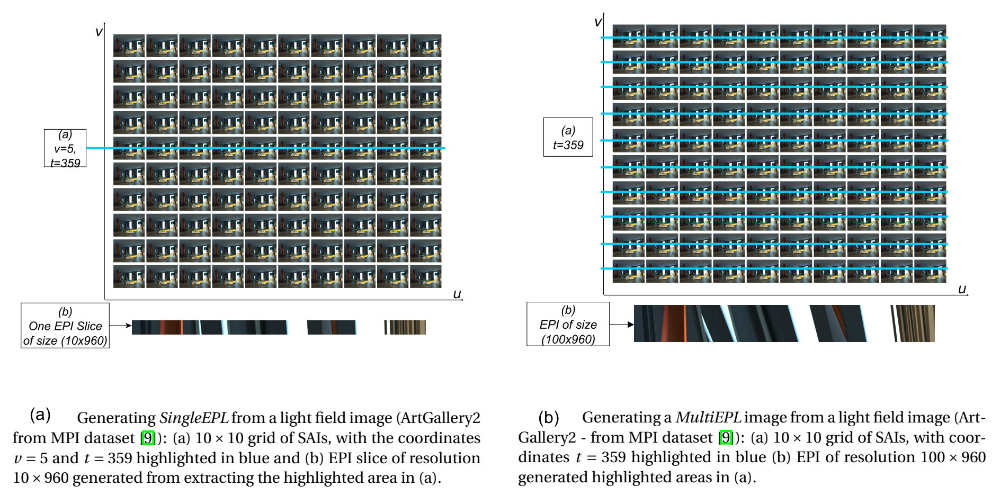

# A-Two-stream-CNN-based-Visual-Quality-Assessment-Method-for-Light-Field-Images

Light Field (LF) cameras are able to capture both the intensity and the direction of light rays from the scene. Thisrich information demands a certain amount of memory and bandwidth for storage and transmission and, to alle-viate this requirement, LF content is processed and compressed. These operations often add degradations to theLF content that may affect their visual quality, requiring the use of methods that are able to measure the visualquality as perceived by the end consumer.  In this paper, we propose a no-reference LF image quality assessment(LF-IQA) method that is based on a two-stream CNN architecture. The two-stream CNN interprets and learnscomplex binocular characteristics in spatial and angular domains of distorted LF contents, and predicts qualityscores that are in correlation with subjective quality assessment. The first stream processes the angular infor-mation from canny maps of Epipolar Plane Images (EPIs) generated from the corresponding LF contents, whilethe second stream processes the spatial information from mean canny maps generated from canny maps of sub-aperture images (SAIs).  We also propose a novel approach to generate multiple epipolar-plane images, and we name this approach as MultiEPL. Results show that the proposed method outperforms state-of-the-art LF-IQAmethods.

# Paper: 
[A two-stream cnn based visual quality assessment method for light field images](https://link.springer.com/article/10.1007/s11042-022-13436-4)

# Base Model:
[StereoQA-Net](https://github.com/weizhou-geek/Stereoscopic-Image-Quality-Assessment-Network)

# MultiEPL Approach
In this work, instead of using a single row as an epipolar plane or line, we process all rows of the grid. We name this approach MultiEPL. Generally, as shown in Figure (a) below, we fix t=359 and process all SAI rows. This way, we extract EPIs of size 10x960, as illustrated in Figure (b). But using the MultiEPL approach, we obtain one EPI of resolution 100x960 for each LFI.

## Code multiEPL_EPIs.py:
To develop MultiEPL approach (multiEPL_EPIs.py), we modified the [base code](https://github.com/andrewhou1/Light-Field-Super-Resolution/blob/master/generateEPI.py).

Steps to run multiEPL_EPIs.py file:
- Change input and output paths accordingly.
- Run the file multiEPL_EPIs.py

## Generation of MLI:
I am grateful to [Chawin-S](https://github.com/Chawin-S) for achieving this task.
The code to generate MLI is given in direcorty Prep:
1. Setup the paths to input in run.m file. 
2. Run run.m to generate MLIs. 

## Requirements:
- Python 3.8
- Numpy
- Imageio
- OpenCV
- MATLAB

### Cite this article:
Alamgeer, S., Farias, M.C. A two-stream cnn based visual quality assessment method for light field images. Multimed Tools Appl (2022). https://doi.org/10.1007/s11042-022-13436-4
